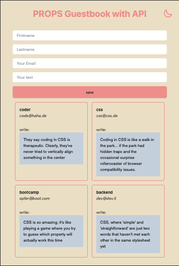
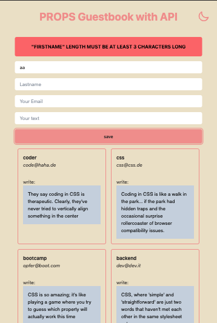
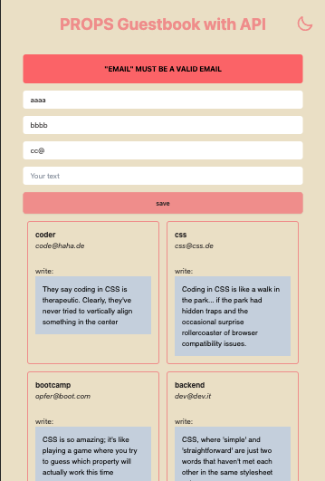
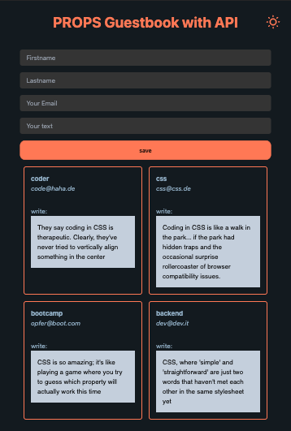
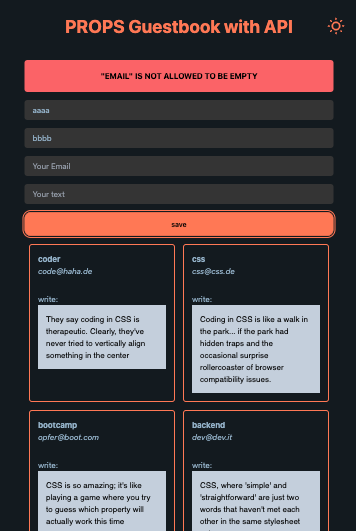
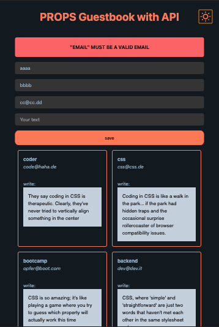

# React + Vite + Tailwind + Daisyui

<!-- Api validation with joi in backend
(npm i joi) -->

All CRUD basic operations of persistent storage works with the Server.

Add Image update

Comming soon only validation

# [Server&Api here](https://github.com/MariaRiosNavarro/guestbook_backend)

# Light

# Dark

install

npm i uuid
