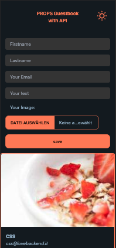
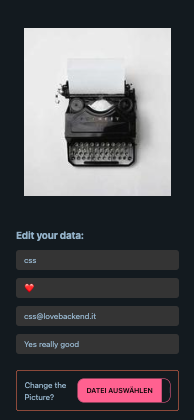
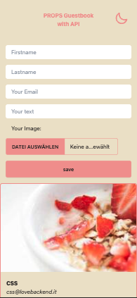
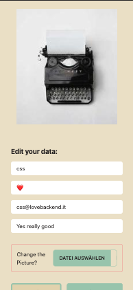
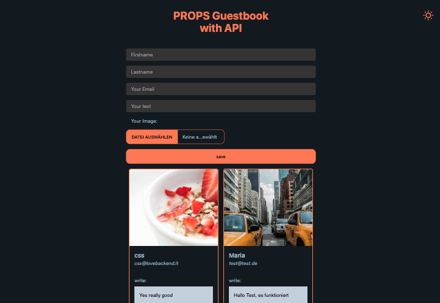
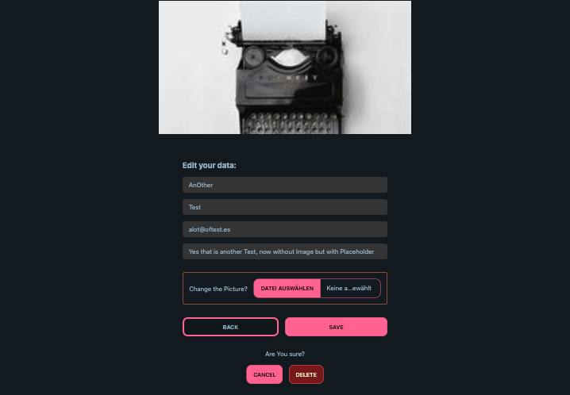
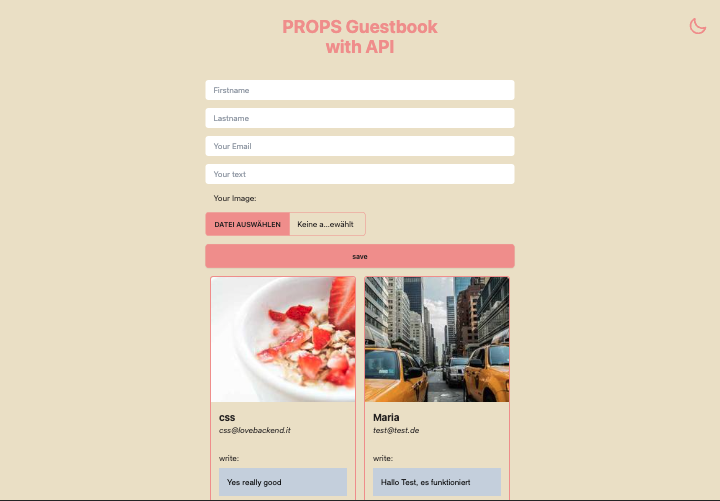
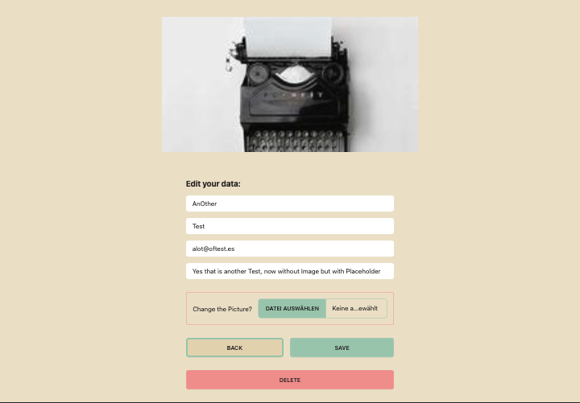
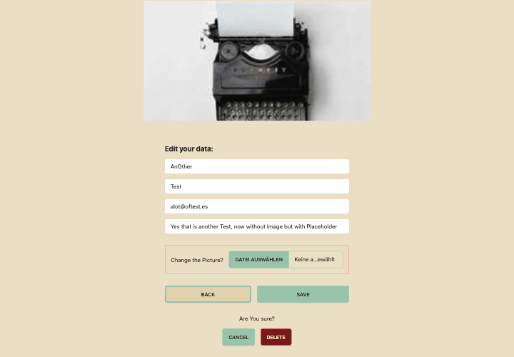

# React + Vite + Tailwind + Daisyui (Mobile & Desktop), Guestbook

All fundamental CRUD operations for persistent storage, including image handling, are operational on the deployed server.

The validation in the server with Joi works in both the main form and the edit form, with error messages displayed through a Toast from the server

Delete Confirmation Added & Enviromental Variables

# [Render Deployment]()

# [Server&Api here](https://github.com/MariaRiosNavarro/guestbook_backend)

# Mobile light&dark

# Desktop light&dark

