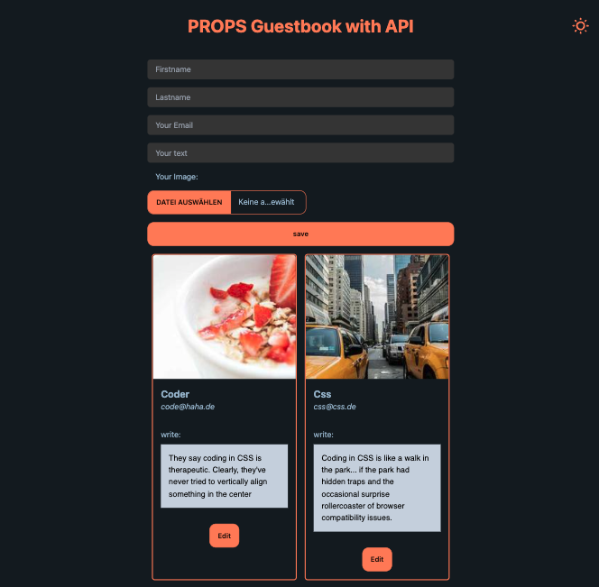
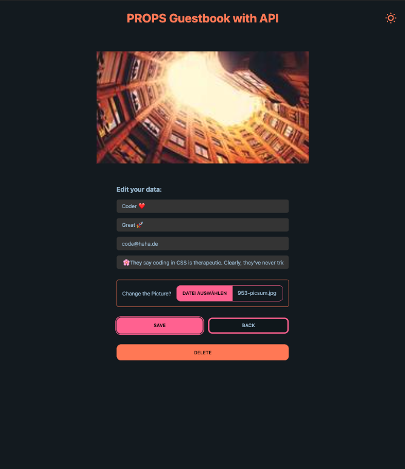
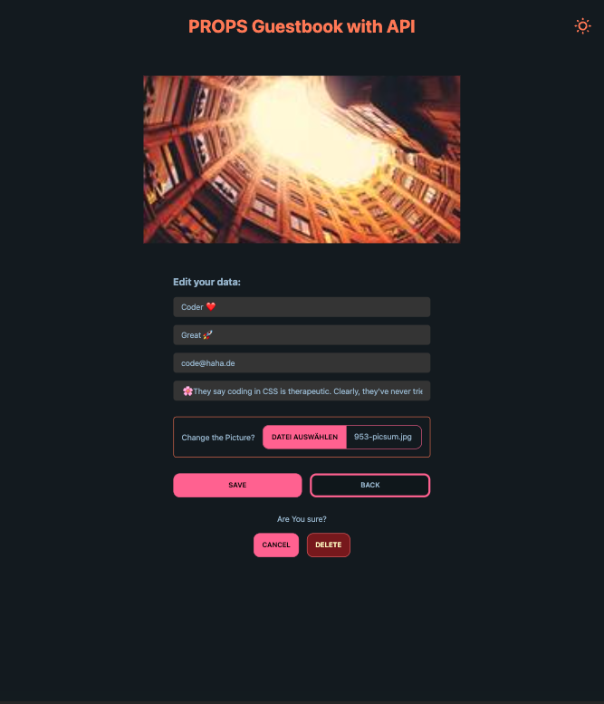

# React + Vite + Tailwind + Daisyui

<!-- Api validation with joi in backend
(npm i joi) -->

All CRUD basic operations of persistent storage with Images works with the Deployed Server.

The validation in the server with Joi works in both the main form and the edit form, with error messages displayed through a Toast from the server

Delete Confirmation Added & Enviromental Variables

# [Render Deployment](https://guestbook-8u4k.onrender.com/)

# [Server&Api here](https://github.com/MariaRiosNavarro/guestbook_backend)

# Light & Dark

